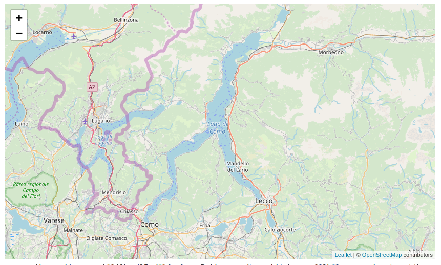
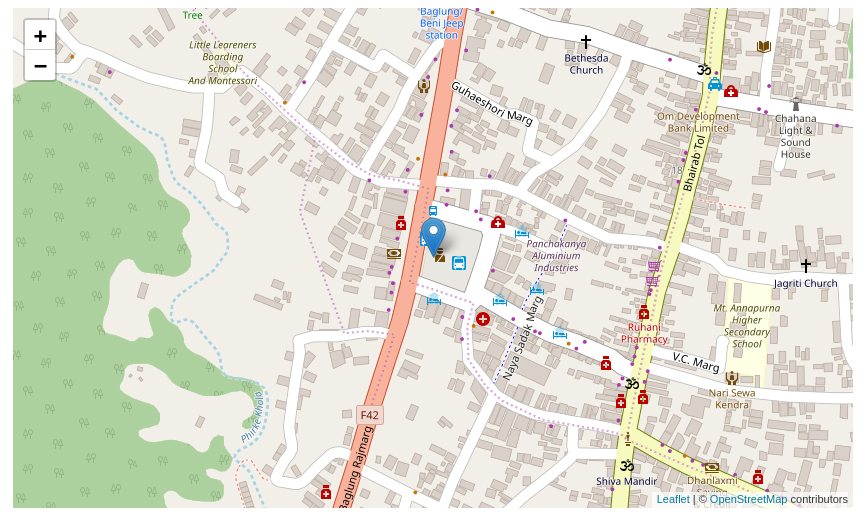
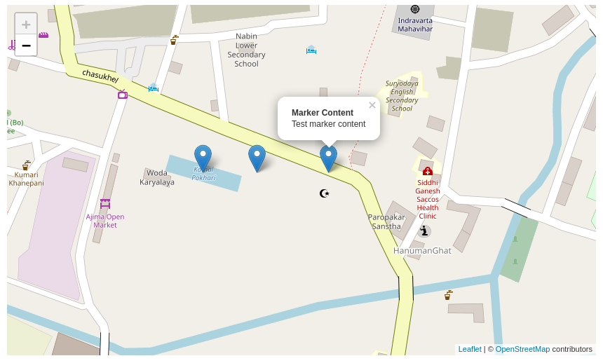
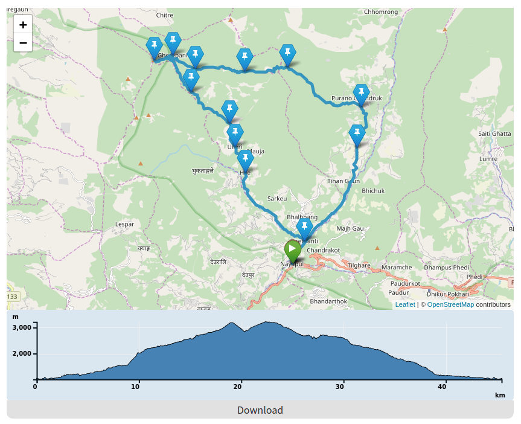
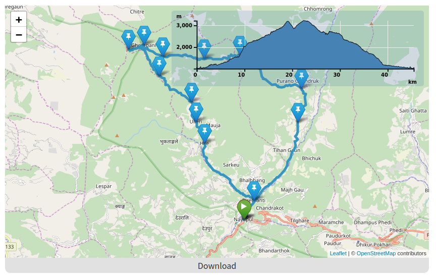

<p align="center">
  <a href="others/images/leaflet.png"></a>
</p>

Shortcodes for inserting a OSM (Open Street Maps) Map, Marker or Track into your posts by using leaflet.

I use [Leaflet](https://github.com/Leaflet/Leaflet), a custom version of [Leaflet Elevation](https://github.com/Raruto/leaflet-elevation) and [Leaflet ExtraMarkers](https://github.com/coryasilva/Leaflet.ExtraMarkers)

Initially based on the work of [Simon Frey](https://github.com/simonfrey/hugo-leaflet)

## Table of Contents

- [Table of Contents](#table-of-contents)
- [Prerequisite](#prerequisite)
- [Installation](#installation)
- [Usage](#usage)
    - [Map only](#map-only)
        - [Shortcut](#shortcut)
        - [Parameters `leaflet-map`](#parameters-leaflet-map)
    - [Map with one marker](#map-with-one-marker)
        - [Shortcut](#shortcut-1)
        - [Parameters `leaflet-marker`](#parameters-leaflet-marker)
    - [Map with multiple marker](#map-with-multiple-marker)
        - [Shortcut](#shortcut-2)
    - [Map with gpx track](#map-with-gpx-track)
        - [Shortcut](#shortcut-3)
        - [Parameters `leaflet-track`](#parameters-leaflet-track)
- [License](#license)

## Prerequisite
Make sure you already have Font Awesome icons in your project

## Installation

[Download the project as ZIP](https://github.com/altrdev/hugo-leaflet/archive/master.zip)

1. Copy the layouts folder over (containing the shortcuts)
2. Copy the assets folder over (containing js)
3. Copy the static folder over (containing css and images)
4. Call the loader partial layout in every post or globally in the theme `{{ partial "leaflet-loader" . }}`

I recommend add it globally in your `<head>` and use a parameter to include or exclude like this:

```
{{ if .Params.maps }}
    {{ partial "leaflet-loader" . }}
{{ end }}
```

## Usage

### Map only

#### Shortcut
```

```

#### Parameters `leaflet-map`

|    **Parameter**    | **Description**                                                                             | **Mandatory** | **Default**            | **Possible values**        |
|:-------------------:|:-------------------------------------------------------------------------------------------:|:-------------:|:----------------------:|:--------------------------:|
| **mapHeight**       | Map height size                                                                             | **no**        | "400px"                | any number in px           |
| **mapWidth**        | Map width size                                                                              | **no**        | "100%"                 | any number in px or %      |
| **mapLat**          | Latitude where to center the map                                                            | **yes**       | ""                     | any valid coords number    |
| **mapLon**          | Longitude where to center the map                                                           | **yes**       | ""                     | any valid coords number    |
| **mapId**           | Unique id. Useful for add multiple map in the post with same longitude and latitude         | **no**        | md5(mapLat,mapLon)     | any string                 |
| **zoom**            | The zoom level. If set, it must be parsable as int.                                         | **no**        | "13"                   | any number                 |
| **scrollWheelZoom** | Enable or disable zoom with mouse scroll wheel                                              | **no**        | "true"                 | `"true"` or `"false"`      |

#### Result


### Map with one marker

#### Shortcut
```

    

```

#### Parameters `leaflet-marker`

| **Parameter**       | **Description**                         | **Mandatory** | **Default**       | **Possible values**      |
|:-------------------:|:---------------------------------------:|:-------------:|:-----------------:|:------------------------:|
| **markerLat**       | Latitude where to place the marker      | **yes**       | ""                | any number in px         |
| **markerLon**       | Longitude where to place the marker     | **yes**       | ""                | any number in px or %    |
| **markerContent**   | Popup content text                      | **no**        | ""                | any text, html accepted  |

#### Result


### Map with multiple marker

#### Shortcut

```

    
    
    

```

#### Result


### Map with GPX track

#### Shortcut
```

    

```

#### Parameters `leaflet-track`

| **Parameter**               | **Description**                                                               | **Mandatory** | **Default**                         | **Possible values**                                                                                                                                                           |
|:---------------------------:|:-----------------------------------------------------------------------------:|:-------------:|:-----------------------------------:|:-----------------------------------------------------------------------------------------------------------------------------------------------------------------------------:|
| **trackPath**               | Your GPX file. You must place in `static/gpx` folder.                         |     **yes**   | ""                                  | any filename like `"my_track.gpx"`                                                                                                                                            |
| **lineColor**               | Line track color                                                              |     **no**    | "#006EFF"                           | any valid hex color                                                                                                                                                           |
| **lineWeight**              | Line track weight on the map                                                  |     **no**    | "3"                                 | any number                                                                                                                                                                    |
| **lineOpacity**             | Line track opacity on the map                                                 |     **no**    | "1"                                 | decimal range from 0 to 1                                                                                                                                                     |
| **graphPosition**           | Elevation graph position on the map. Not valid if you use `graphDetached`     |     **no**    | "topright"                          | `"myLocation"`                                                                                                                                                                |
| **graphTheme**              | Elevation graph theme already present                                         |     **no**    | "steelblue-theme"                   | `"steelblue-theme"`, `"lime-theme"` or `"purple-theme"`                                                                                                                       |
| **graphWidth**              | Elevation graph width. Not valid if you use `graphDetached`                   |     **no**    | "500"                               | any number                                                                                                                                                                    |
| **graphHeight**             | Elevation graph height                                                        |     **no**    | "150"                               | any number                                                                                                                                                                    |
| **graphFollowMarker**       | Auto zoom on the mouse movement over the map                                  |     **no**    | false                               | `true` or `false`                                                                                                                                                             |
| **graphCollapsed**          | Hide elevation graph below the button                                         |     **no**    | false                               | `true` or `false`                                                                                                                                                             |
| **graphDetached**           | Detach elevation graph outside map                                            |     **no**    | true                                | `true` or `false`                                                                                                                                                             |
| **markerIcon**              | Waypoint Fontawesome icon name                                                |     **no**    | "fa-thumb-tack"                     | `"fa-thumb-tack"` (see fontawesome documentation)                                                                                                                             |
| **markerIconColor**         | Waypoint icon color                                                           |     **no**    | "cyan"                              | `"red"`, `"orange-dark"`, `"orange"`, `"yellow"`, `"blue-dark"`, `"cyan"`, `"purple"`, `"violet"`, `"pink"`, `"green-dark"`, `"green"`, `"green-light"`, `"black"`, `"white"` |
| **markerIconShape**         | Waypoint icon shape                                                           |     **no**    | "penta"                             | `"circle"`, `square`, `penta` or `star`                                                                                                                                       |
| **markerIconClasses**       | Extra classes for extends icon css                                            |     **no**    | "fa-icon-marker"                    | `"my-class my-second-class"`                                                                                                                                                  |
| **markerStartIcon**         | Start Waypoint Fontawesome icon name                                          |     **no**    | "fa-play"                           | `"fa-play"` (see fontawesome documentation)                                                                                                                                   |
| **markerStartIconColor**    | Start Waypoint icon color                                                     |     **no**    | "green-light"                       | `"red"`, `"orange-dark"`, `"orange"`, `"yellow"`, `"blue-dark"`, `"cyan"`, `"purple"`, `"violet"`, `"pink"`, `"green-dark"`, `"green"`, `"green-light"`, `"black"`, `"white"` |
| **markerStartIconShape**    | Start Waypoint icon shape                                                     |     **no**    | "circle"                            | `"circle"`, `square`, `penta` or `star`                                                                                                                                       |
| **markerStartIconClasses**  | Extra classes for extends start icon css                                      |     **no**    | "fa-icon-marker fa-icon-start-stop" | `"my-class my-second-class"`                                                                                                                                                  |
| **markerEndIcon**           | End Waypoint Fontawesome icon name                                            |     **no**    | "fa-flag-checkered"                 | `"fa-flag-checkered"` (see fontawesome documentation)                                                                                                                         |
| **markerEndIconColor**      | End Waypoint icon color                                                       |     **no**    | "red"                               | `"red"`, `"orange-dark"`, `"orange"`, `"yellow"`, `"blue-dark"`, `"cyan"`, `"purple"`, `"violet"`, `"pink"`, `"green-dark"`, `"green"`, `"green-light"`, `"black"`, `"white"` |
| **markerEndIconShape**      | End Waypoint icon shape                                                       |     **no**    | "circle"                            | `"circle"`, `square`, `penta` or `star`                                                                                                                                       |
| **markerEndIconClasses**    | Extra classes for extends end icon css                                        |     **no**    | "fa-icon-marker fa-icon-start-stop" | `"my-class my-second-class"`                                                                                                                                                  |

#### Result


With `graphDetached=false`




## License
<p>
  <a href="./LICENSE"></a>
</p>
